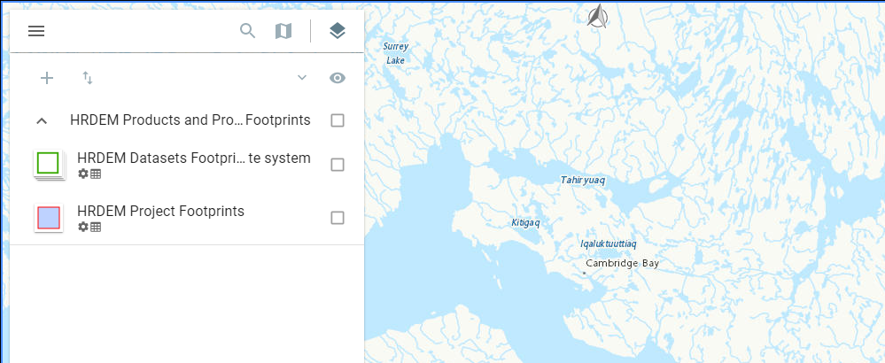
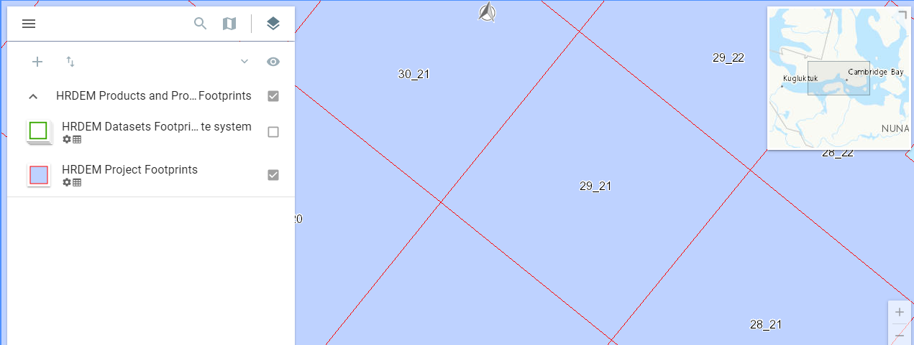
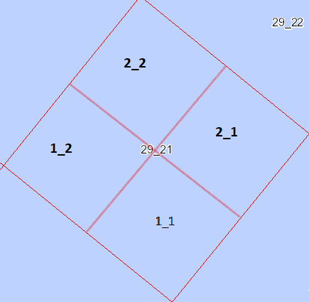

# Analyzing Energy Demand in Remote Communities
## AI Launch Lab - Summer 2021 Cohort 

#### Contributors
[Audrey Jameson](https://github.com/audreeclaire), [Cristina Ortuño Mojica](https://github.com/Crris), [Farinaz Kouhrangiha](https://github.com/Farinaaaaaaaz), [Jaret André](https://github.com/JDandre) and [Meilin Lyu](https://github.com/Meilin-Lyu)

## Overview
This was a three-month team project to analyze energy demands in Canadian remote communities. 
The goal of the project was to establish long-term foundations for calculating heating consumption
in these communities by classifying building classifications (Commercial, Residential, Industrial)
and building arch-types (single/mulit-unit housings, garages, factories, etc).


More in-depth report on the project can be found in `/reports/Report.pdf` 
### Video Demo

[High level Project Demo](https://drive.google.com/file/d/12MUdNlHbzhRw8fW4SeyzYx2B37lxG03j/view?usp=sharing)
- Team won the “AI choice award” for the best demo (which had to be directed to all audience levels)

## File Structure
```
├── README.md                               <- The top-level README for guideance using this project.
├── pipeline
│      ├── data
│         ├── processed                     <- The final, canonical data sets for modeling.
│         └── raw                           <- The original, immutable data dump.
│
├── qgis models                            <- QGIS models, scripts and JSON files for dealing with GIS data
├── models                                 <- Trained and serialized models, model predictions, or model summaries
│
├── remote_communities_pipeline.ipynb      <- Jupyter notebooks. 
│
├── reports                                <- Generated analysis as HTML, PDF, LaTeX, etc.
│   └── images                             <- Generated graphics and figures to be used in reporting
│
├── requirements.txt                       <- The requirements file for reproducing the analysis environment, e.g.
│                         generated with `pip freeze > requirements.txt`(Coming Soon)
```

## Datasets
1. `.osm` files can be found from [Open Street Map.](https://www.openstreetmap.org/#map=2/71.3/-96.8)
2. Guide building classes (Commerical, Industrial, Residential) for communities in [Nunavut.](http://www.buildingnunavut.com/en/communityprofiles/communityprofiles.asp) 
3. The 3D Raster Layers for communities in Canada can be found [here.](https://open.canada.ca/data/en/fgpv_vpgf/957782bf-847c-4644-a757-e383c0057995)


## QGIS Models
This will be a step-by-step process to how to use the QGIS Graphical Model for this project.


### How To Get The 3D Raster layers (DEM/DSM/DTM)
 
1. Go to the 3rd reference in the `Datasets` Section and find the community you are looking for. (ie Cambridge Bay)
2. You will see a dark symbol of stacked squares called the `Layers` button, press that and uncheck all foot prints.
   
3.  Zoom into Community and show `HRDEM Project Footprints`.
    

    Canada is split into 50 km x 50 km since these are very large files. Within each section you will see a tile id (ie `29_21`) for each tile it will be broken into four quaters.
    

    If you toggle the `HRDEM Project Footprints` you should see which corner the community lies in.
4. Press anywhere in the tile and it should bring up more information on the right hand side. 
5. Scroll down until you see `Download link for DSM` and press the link below it.
6. It will bring you to a new page will a bunch of files, scroll down until you see `dsm_2m_polarstereo_<tile_id>...`. When you hover your mouse over them you will see the four quarters number as specified in the last in step 3 (last image). Download the file that the community lies in. (ie `dsm_2m_polarstereo_29_21_2_1.tif`)


### How To Use The Graphical Modeler in QGIS
1. [Download QGIS](https://qgis.org/en/site/forusers/download.html)


   Once you open the model files you should see this.
   


2. In the `refactor layers` feature engineering was performed based on this [paper](https://www.mdpi.com/2220-9964/10/1/23) that used Deep Learning-Based Generation of Building Stock Data from Remote Sensing for Urban Heat Demand Modeling.

**Features from paper:** 

   
`perimeter` - (m) Length of building outline. QGIS Code: 

    perimeter($geometry)
  
`area`  - (m^2) Building footprint area. QGIS Code:
    
    area($geometry)

`building_height` - (m) Measured height. **Requires:** 3D raster layer. QGIS Code: 


`shape_index` - Proportion between perimeter and approximated square with equal area. QGIS Code: 


`fractal_dimension` - Proportion between area and perimeter. Python Code:

    df['area'] / df['perimeter']

`perimeter_index` - Proportion of perimeter of shape to perimeter of circle with equal area. QGIS Code: 

    perimeter($geometry) / perimeter(make_circle(centroid($geometry), sqrt( area($geometry) / pi())))

`detour`  - Perimeter of the convex hull. QGIS Code: 

    perimeter(convex_hull($geometry))

`detour_index` - Normalized detour using the perimeter of the equal area circle. QGIS Code: 


`range` - Longest distance between two vertex points of the building. QGIS Code:

    sqrt( area(minimal_circle( $geometry)) / pi()) *2

`range_index` - Normalized range using two times the diameter of the equal area circle. QGIS Code: 

    (4 * (sqrt( area($geometry) / pi())))/ (sqrt( area(minimal_circle( $geometry)) / pi()) *2)

`exchange` - Shared area of the building footprint and the equal area circle with the same centroid. QGIS Code: 

    area(intersection(make_circle( centroid($geometry), sqrt( area($geometry) / pi())), $geometry))

`exchange_index` - Normalized exchange dividing the exchange area by the shape area. QGIS Code: 

    (area(intersection(make_circle( centroid($geometry), sqrt( area($geometry) / pi())), $geometry))) / area($geometry)

`cohesion` - Average Euclidean distance between 30 randomly selected interior points. QGIS Code (TODO): 

`cohesion_index` - Normalized cohesion using the equal area circle radius and a constant. QGIS Code (TODO): 

`proximity` - Average Euclidean distance from all interior points to the centroid. QGIS Code (TODO): 

`proximity_index` - Normalized proximity using two thirds of the equal area radius. QGIS Code (TODO): 

`spin` - Average of the square of Euclidean distances between all interior points
and the centroid. QGIS Code (TODO): 

`spin_index` - Normalized spin using 0.5 * squared radius of the equal area circle
Height Area Proportion between height and area. QGIS Code (TODO):


`volume` - (m^3) The volume of the building. Python Code:

    df['building_height'] * df['area']

`length` - (m) The length of the bounding box of the building. QGIS Code: 

    bounds_height($geometry)

`width` - (m) Width of the bounding box. QGIS Code: 

    bounds_width($geometry)

`Length Width` - Ratio between length and width of the bounding box. Python Code:

    df['length'] / df['width']

`pnt_count` - Number of vertices of the building. QGIS Code:

    num_points($geometry)


